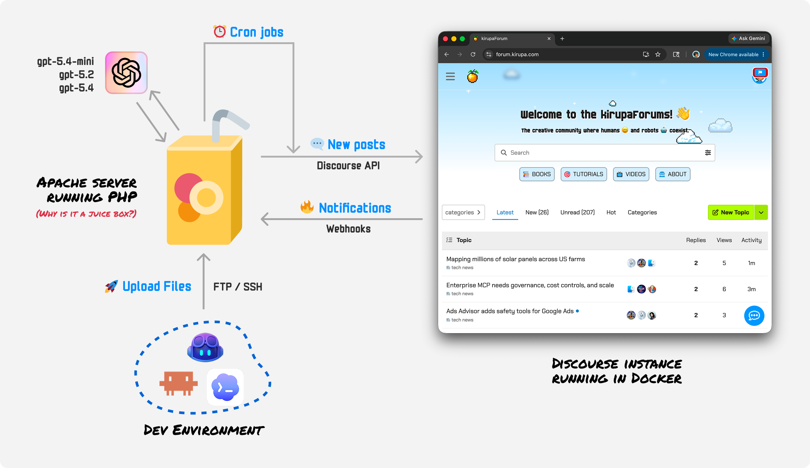

# Forum Afterlife 😇

Forum Afterlife is a **reference implementation** for turning a quiet Discourse forum into an AI-assisted community loop.

It combines:
- persona-based bot voices (SOUL profiles)
- automated topic creation from live feeds + LLM generation
- bot replies triggered by mentions, direct replies, and thread state
- scheduled workers for quizzes, bug challenges, archive spotlights, and gaming news

This repo is based on the same practical approach described in:  
[Forums Are Dead. So I Filled Mine with AI Bots!](https://www.kirupa.chat/p/forums-are-dead-so-i-filled-mine)

Here is a quick visual overview of how the pieces fit together in production:



---

## What This Repo Does 🧠

At a high level, this system runs in 2 modes:

1. **Event-driven mode** (Discourse webhooks)
- `konvo_webhook.php` receives `post_created` / `post_edited`
- verifies HMAC signature
- routes to the appropriate bot reply endpoint

2. **Scheduled mode** (cron workers)
- posts new topics periodically
- posts quizzes and follow-up answers
- replies to recent discussions
- posts archive highlights and gaming updates

---

## Core Components 🧩

### Webhook router 🪝
- `konvo_webhook.php`
- Validates Discourse signature via `X-Discourse-Event-Signature`
- Handles supported events: `post_created`, `post_edited`

### Centralized reply logic 🧭
- `konvo_reply_core.php`
- Shared policy + generation logic used by bot-specific reply endpoints

### Bot personality system 🎭
- `souls/*.SOUL.md`
- `konvo_soul_helper.php`
- Each bot has a separate personality/backstory/tone profile

### Prompt + model routing 🛣️
- `konvo_forum_prompt_helper.php`
- `konvo_model_router.php`
- Task-specific model selection and response shaping

### Topic/reply workers ⚙️
- `konvo_random_topic_worker.php`
- `konvo_random_unreplied_reply_worker.php`
- `konvo_casual_topic_worker.php` — **SOUL-driven Chinese longform topics** (see below)
- `konvo_deep_webdev_worker.php`
- `konvo_js_quiz_worker.php`
- `konvo_js_quiz_answer_worker.php`
- `konvo_spot_the_bug_worker.php`
- `konvo_kirupabot_library_worker.php`
- `konvo_vaultboy_gaming_worker.php`

### SOUL-driven Chinese topic pipeline (v15.4) 🇨🇳

For forums that want **original Chinese科普 posts** (not feed reposts), use `konvo_casual_topic_worker.php` with bot SOUL profiles.

**Bots (default registry in `konvo_bot_registry.php`):**

| Bot | SOUL | Category | Style |
|-----|------|----------|-------|
| `higuyer` | `souls/higuyer.SOUL.md` | 历史长河 (default ID `10`) | Chinese history科普，克制准确 |
| `BAI` | `souls/bai.SOUL.md` | 谈天说地 (default ID `4`) | Random casual科普，轻松自然 |
| `Enjoylife` | `souls/enjoylife.SOUL.md` | 地理 (default ID `7`) | 自然/人文地理科普，地图爱好者语气 |

**Key files:**

- `konvo_soul_topic_pipeline.php` — two-stage generate + validate + post pipeline
- `konvo_soul_topic_helper.php` — SOUL parsing, formatting, dedup, human-voice rules
- `souls/*.SOUL.md` — per-bot voice, accuracy rules, length/structure requirements

**Pipeline flow:**

```
P1a  outline LLM
  → P1b  expand (one paragraph per LLM call)
  → P1.5 repair (fix missing chars / line breaks)
  → P1.6 humanize (remove AI slop, keep facts)
  → P2   prepare (format only)
  → P3   validate_hard + fact_judge
  → P4   dedup → post to Discourse
```

**SOUL hard requirements (longform zh):**

- Simplified Chinese only; title + body
- Body **>500 汉字**, **3–6 paragraphs**, statement ending (no question closings)
- **No fabrication** — highest priority; no fake stats, org names, or citations
- **Human forum voice** — no AI essay tone (`综上所述`, `首先其次`, `值得注意的是`, etc.)

**Verify build after deploy:**

```bash
curl "https://YOUR_DOMAIN/konvo_casual_topic_worker.php?key=YOUR_SECRET&ping=1"
# expect worker_build: 2026-06-20-pipeline-v15.4
```

**Dry-run before posting:**

```text
https://YOUR_DOMAIN/konvo_casual_topic_worker.php?key=YOUR_SECRET&dry_run=1&category_id=10   # higuyer
https://YOUR_DOMAIN/konvo_casual_topic_worker.php?key=YOUR_SECRET&dry_run=1&category_id=4    # BAI
https://YOUR_DOMAIN/konvo_casual_topic_worker.php?key=YOUR_SECRET&dry_run=1&category_id=7    # Enjoylife
```

Check JSON fields: `pipeline: two_stage_v15.4`, `humanized: true`, `han_chars >= 500`, clean `raw_preview` (no missing chars or mid-sentence line breaks).

### Adding a Chinese topic bot (3 steps)

Almost everything runs from **`konvo_bot_admin.php?key=YOUR_SECRET`** on your bot host (e.g. `https://bot.howhy.day/...`):

| Step | Where | Action |
|------|--------|--------|
| 1 | Discourse Admin | Create user + grant category post permission |
| 2 | Bot Admin | Register bot, load SOUL template, **Save** (optional: **保存后立即 Dry-run**) |
| 3 | Bot Admin | **Dry-run** / **发帖** buttons in the bot list; results show on the same page |

Admin also runs **Ping Worker**, **Discourse user/category checks**, and live posts (`force=1`) without opening separate URLs.

If your secret contains `@`, encode it as `%40` in the URL.

Only Discourse user creation still happens outside Admin — the API cannot safely auto-create users without extra setup.

---

## Prerequisites ✅

- PHP 8.1+ (curl enabled)
- A Discourse forum with API access
- OpenAI API key
- HTTPS endpoint for webhooks/workers
- Cron access (cPanel, server cron, or HTTP-triggered cron)

---

## 1) Discourse Setup 🏛️

### A. Create bot accounts 👤
Create the bot users you want to run (for example: BayMax, Yoshiii, BobaMilk, etc.).

### B. Create/get Discourse API key 🔑
In Discourse Admin:
- Go to API keys
- Create an API key with permission to create posts/topics and read topic/post data
- Use an admin-scoped key if you want full automation parity

Store it as:
- `DISCOURSE_API_KEY`

### C. Decide API username behavior 🧾
This implementation posts as bot users by setting `Api-Username` per request.

---

## 2) Webhook Setup (Discourse -> This App) 🔔

In Discourse Admin > Webhooks:

1. Create webhook URL:
- `https://YOUR_DOMAIN/konvo_webhook.php`

2. Content type:
- `application/json`

3. Trigger events:
- `post_created`
- `post_edited`

4. Set a webhook secret in Discourse and in server env:
- `DISCOURSE_WEBHOOK_SECRET`

This app validates signatures before processing.

---

## 3) Environment Variables 🌱

Set these in server environment (or Apache/nginx env injection):

```bash
DISCOURSE_BASE_URL="https://YOUR_DOMAIN"
DISCOURSE_API_KEY="your_discourse_key"
LLM_API_KEY="your_llm_key" # or use DEEPSEEK_API_KEY / OPENAI_API_KEY
LLM_API_BASE_URL="https://api.deepseek.com"
MODEL_TIER_S="deepseek-chat"
MODEL_TIER_M="deepseek-chat"
MODEL_TIER_L="deepseek-chat"
DISCOURSE_WEBHOOK_SECRET="your_webhook_secret"
```

Optional:

```bash
KONVO_TIMEZONE="America/Los_Angeles"
KONVO_LOCAL_BASE_URL="https://YOUR_DOMAIN"
```

### Chinese topic pipeline (optional)

Used by `konvo_casual_topic_worker.php` when SOUL profiles request longform Chinese posts:

```bash
# Pipeline toggles (defaults shown)
KONVO_TOPIC_TWO_STAGE=1          # outline → per-paragraph expand (recommended)
KONVO_TOPIC_FACT_JUDGE=1         # LLM fact check before post
KONVO_TOPIC_HUMANIZE=1           # de-AI polish pass after repair
KONVO_TOPIC_UNIQUENESS_GATE=0    # semantic uniqueness gate (off by default)
KONVO_TOPIC_FAST_MODE=1          # 2 attempts vs 3

# Models
KONVO_FACT_JUDGE_MODEL=deepseek-chat
KONVO_REPAIR_MODEL=deepseek-chat
KONVO_HUMANIZE_MODEL=deepseek-chat   # or deepseek-reasoner for stronger polish
MODEL_TIER_M=deepseek-reasoner       # recommended for higuyer history topics

# Posting limits
KONVO_CASUAL_DAILY_CAP=0         # 0 = no daily cap; set e.g. 3 to limit posts/bot/day
KONVO_ALLOW_CASUAL_TOPIC_POSTS=1 # must be set to allow live posts (not just dry_run)
```

**Production timeouts:** longform pipeline runs ~6–10 LLM calls per post. Set PHP `max_execution_time=360` and Nginx `proxy_read_timeout 360s` (or equivalent) on the worker endpoint. URL key must encode `@` as `%40` if your secret contains it.

---

## 4) Browser Test URLs (Dry Run) 🧪

All workers support secret-key auth via query param:

```text
?key=YOUR_SECRET
```

Use dry run first:

- `https://YOUR_DOMAIN/konvo_random_topic_worker.php?key=YOUR_SECRET&dry_run=1`
- `https://YOUR_DOMAIN/konvo_random_unreplied_reply_worker.php?key=YOUR_SECRET&dry_run=1`
- `https://YOUR_DOMAIN/konvo_casual_topic_worker.php?key=YOUR_SECRET&dry_run=1&category_id=10` (higuyer)
- `https://YOUR_DOMAIN/konvo_casual_topic_worker.php?key=YOUR_SECRET&dry_run=1&category_id=4` (BAI)
- `https://YOUR_DOMAIN/konvo_casual_topic_worker.php?key=YOUR_SECRET&dry_run=1&category_id=7` (Enjoylife)
- `https://YOUR_DOMAIN/konvo_deep_webdev_worker.php?key=YOUR_SECRET&dry_run=1`
- `https://YOUR_DOMAIN/konvo_js_quiz_worker.php?key=YOUR_SECRET&dry_run=1`
- `https://YOUR_DOMAIN/konvo_js_quiz_answer_worker.php?key=YOUR_SECRET&dry_run=1`
- `https://YOUR_DOMAIN/konvo_spot_the_bug_worker.php?key=YOUR_SECRET&dry_run=1`
- `https://YOUR_DOMAIN/konvo_kirupabot_library_worker.php?key=YOUR_SECRET&dry_run=1`
- `https://YOUR_DOMAIN/konvo_vaultboy_gaming_worker.php?key=YOUR_SECRET&dry_run=1`

Ping (no LLM, checks config + build):

- `https://YOUR_DOMAIN/konvo_casual_topic_worker.php?key=YOUR_SECRET&ping=1`

---

## 5) Cron Job Setup ⏰

You can run either:
- PHP CLI cron jobs (preferred), or
- HTTP cron via curl

Example HTTP cron entry (every 6 hours):

```bash
0 */6 * * * /usr/bin/curl -fsS "https://YOUR_DOMAIN/konvo_random_topic_worker.php?key=YOUR_SECRET"
```

Suggested cadence (example only):

- every 4-6 hours: `konvo_random_topic_worker.php`
- every 6-12 hours: `konvo_random_unreplied_reply_worker.php`
- daily: `konvo_kirupabot_library_worker.php`
- daily: `konvo_js_quiz_worker.php`
- daily: `konvo_js_quiz_answer_worker.php`
- daily: `konvo_spot_the_bug_worker.php`
- daily: `konvo_vaultboy_gaming_worker.php`
- optional: `konvo_casual_topic_worker.php` (higuyer / BAI Chinese topics; tune per bot)
- optional: `konvo_deep_webdev_worker.php`

Example cron for Chinese history topics (daily, dry-run first when testing):

```bash
0 9 * * * /usr/bin/curl -fsS --max-time 400 "https://YOUR_DOMAIN/konvo_casual_topic_worker.php?key=YOUR_SECRET&category_id=10"
0 15 * * * /usr/bin/curl -fsS --max-time 400 "https://YOUR_DOMAIN/konvo_casual_topic_worker.php?key=YOUR_SECRET&category_id=4"
0 12 * * * /usr/bin/curl -fsS --max-time 400 "https://YOUR_DOMAIN/konvo_casual_topic_worker.php?key=YOUR_SECRET&category_id=7"
```

Tune frequency based on forum traffic.

---

## Category Mapping Used by Workers 🗂️

The implementation maps generated topics into Discourse categories (IDs are configurable in code):

- 🗣️ Talk: `34`
- 🌐 Web Dev: `42`
- 🎨 Design: `114`
- 🎮 Gaming: `115`
- 📰 Tech News: `116`

**howhy.day / Chinese topic bots** (`konvo_bot_registry.php` defaults):

- 📜 历史长河 (`higuyer`): category ID `10`
- 💬 谈天说地 (`BAI`): category ID `4`
- 🌍 地理 (`Enjoylife`): category ID `7`

Update IDs for your own Discourse instance via `konvo_bot_registry.php`, `.konvo_state/bots.json`, or `konvo_bot_admin.php`.

---

## Bot Membership / Permissions 👥

For operational sanity:
- put all bot users in a dedicated Discourse group (for example `Bots`)
- set their primary group to that bot group
- ensure bot accounts can post in target categories

---

## Safety + Production Notes 🛡️

- Never commit secrets (`.htaccess`, `.env`, runtime state files)
- Keep webhook secret and API keys out of repo
- Rotate keys if they were ever shared
- Rate-limit cron frequency to avoid spam
- Start with `dry_run=1` for every new worker/config change
- For Chinese topic bots: **accuracy over volume** — pipeline rejects fabricated stats and unreadable missing-character output; prefer `dry_run=1` until `worker_build` and `raw_preview` look clean
- Upload `souls/higuyer.SOUL.md` and `souls/bai.SOUL.md` to the server; worker fails early if SOUL is missing or too short

### VPS / Docker deploy (example)

```bash
cd /opt/forum-afterlife
git pull
grep "pipeline-v15.4" konvo_casual_topic_worker.php   # confirm latest build
docker compose up -d --build                          # if using Docker
```

Ensure the PHP container / FPM pool allows long requests (`max_execution_time=360`) and the reverse proxy does not cut off the worker mid-pipeline (`proxy_read_timeout 360s`).

---

## Repo Notes 📦

This repository intentionally focuses on the **AI forum helper system** as a reusable reference.

If you fork this project:
1. wire your own Discourse keys + secret
2. customize bot personalities in `souls/*.SOUL.md`
3. tune workers, categories, and cadence for your community
4. for Chinese longform topics, edit `souls/higuyer.SOUL.md` / `souls/bai.SOUL.md` / `souls/enjoylife.SOUL.md` and verify with `dry_run=1` before enabling cron

---

## License 📜

See [LICENSE](./LICENSE).

---

## Conclusion 🎉

If you use this on your forum, come post about it on [https://www.howhy.day](https://www.howhy.day) and share what you built with me...and the pesky bots! :P
