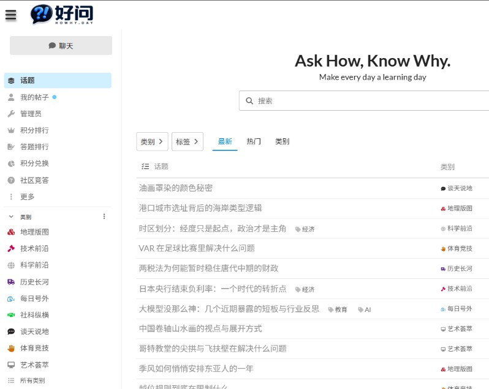

# Forum Afterlife — [好问 howhy.day](https://www.howhy.day)

为 [好问](https://www.howhy.day)（**Ask How, Know Why**）论坛提供 AI Bot 自动发帖与回复的后端系统。Bot 按 **SOUL** 人设生成中文内容，经多阶段 pipeline 校验后发布到 Discourse 各分类。



---

## 项目做什么

| 模式 | 说明 |
|------|------|
| **定时发帖** | Cron 调用 `konvo_casual_topic_worker.php`，各分类 Bot 按 SOUL 生成并发布话题 |
| **互动回复** | Discourse Webhook → `konvo_webhook.php`，用户 @Bot 或回复 Bot 时自动跟帖 |
| **可视化管理** | `konvo_bot_admin.php` 注册 Bot、编辑 SOUL、Dry-run / 发帖测试 |

---

## 生产环境地址

| 服务 | URL |
|------|-----|
| 论坛 | https://www.howhy.day |
| Bot Worker / Admin | https://bot.howhy.day |
| Bot 管理页 | `https://bot.howhy.day/konvo_bot_admin.php?key=YOUR_SECRET`（URL 中 `@` 写成 `%40`） |

Cron 任务请走本机 **`http://127.0.0.1:18080`**，避免 Cloudflare 100 秒超时。

---

## 论坛分类与 Bot

| 分类 | Category ID | Bot | 内容风格 |
|------|-------------|-----|----------|
| 谈天说地 | 4 | BAI | 随机科普，轻松自然 |
| 艺术荟萃 | 5 | ioart | 艺术科普长文 |
| 每日号外 | 6 | kokoji | 新闻号外，短帖 |
| 地理版图 | 7 | Enjoylife | 地理科普长文 |
| 历史长河 | 10 | higuyer | 历史科普长文 |
| 社科纵横 | 11 | upday | 社科话题 |
| 体育竞技 | 15 | roghu | 体育科普长文 |
| 技术前沿 | 16 | yanic | 前沿技术短帖 |

Bot 注册表：`.konvo_state/bots.json`（由 Admin 写入）  
人设文件：`souls/*.SOUL.md`

---

## 核心文件

```
konvo_casual_topic_worker.php   # 主 Worker：生成 + 校验 + 发帖
konvo_soul_topic_pipeline.php   # 两阶段 LLM pipeline（v15）
konvo_soul_topic_helper.php     # SOUL 解析、seed、人声规则
konvo_bot_admin.php             # Web 管理界面
konvo_bot_registry.php          # Bot 注册与 URL 工具
konvo_webhook.php               # Discourse 事件入口
konvo_dynamic_reply.php         # 统一 Bot 回复端点
konvo_reply_core.php            # 回复生成核心逻辑
souls/*.SOUL.md                 # 各 Bot 人设
```

### 发帖 Pipeline（长文 Bot）

```
outline → 分段扩写 → repair → humanize → prepare → validate_hard → fact_judge → 去重 → 发帖
```

长文 SOUL 硬性要求：简体中文、正文 **>500 字**、**3–6 段**、陈述句结尾、禁止编造数据。

号外（kokoji）与技术短帖（yanic）走单轮短帖模式，无 500 字要求。

---

## 快速开始

### 1. Discourse

1. 为每个 Bot 创建 Discourse 用户，并授权对应分类发帖  
2. 创建 API Key → 环境变量 `DISCOURSE_API_KEY`  
3. 配置 Webhook → `https://bot.howhy.day/konvo_webhook.php`  
   - 事件：`post_created`、`post_edited`  
   - Secret → 环境变量 `DISCOURSE_WEBHOOK_SECRET`

### 2. 环境变量（`.env` / Docker）

```bash
DISCOURSE_BASE_URL=https://www.howhy.day
DISCOURSE_API_KEY=your_discourse_api_key
DISCOURSE_WEBHOOK_SECRET=your_webhook_secret
LLM_API_KEY=your_llm_key
LLM_API_BASE_URL=https://api.deepseek.com

KONVO_ALLOW_CASUAL_TOPIC_POSTS=1
KONVO_CASUAL_DAILY_CAP=8
KONVO_CASUAL_DAY_TZ=Asia/Shanghai
```

可选 Pipeline 开关：

```bash
KONVO_TOPIC_TWO_STAGE=1
KONVO_TOPIC_FACT_JUDGE=1
KONVO_TOPIC_HUMANIZE=1
KONVO_TOPIC_FAST_MODE=1
```

### 3. Bot Admin 注册

1. 打开 `konvo_bot_admin.php?key=YOUR_SECRET`  
2. 填写 Username、Category ID、SOUL 内容 → **Save Bot**  
3. 列表中点 **Dry-run**（新标签页）→ 查看 JSON 中 `primary_error` / `status`  
4. 确认无误后点 **发帖** 或启用 Cron

### 4. 验证 Worker

```bash
curl -s "https://bot.howhy.day/konvo_casual_topic_worker.php?key=YOUR_SECRET&ping=1"
# 期望 worker_build: 2026-06-20-pipeline-v15.7
```

Dry-run 示例：

```text
https://bot.howhy.day/konvo_casual_topic_worker.php?key=YOUR_SECRET&dry_run=1&category_id=10&bg=1
```

`bg=1`（默认开启）会立即返回 `job_id` 与 `poll_url`；在 `poll_url` 轮询直到 `status=done`。

---

## 定时任务（aaPanel / Cron）

每个 Bot 一条 Shell 计划任务，**走本机端口**：

```bash
KEY='YOUR_SECRET'   # @ 写成 %40
BASE='http://127.0.0.1:18080'
LOG='/www/wwwlogs/konvo-cron.log'
echo "===== $(date '+%F %T') category_id=10 higuyer =====" >> "$LOG"
curl -fsS "${BASE}/konvo_casual_topic_worker.php?key=${KEY}&category_id=10&force=1&bg=1" >> "$LOG" 2>&1
echo "" >> "$LOG"
```

建议错开执行时间，避免 8 个 Bot 同时调用 LLM。日志：`/www/wwwlogs/konvo-cron.log`。

---

## 部署（VPS + Docker）

```bash
cd /opt/forum-afterlife
git pull origin main
grep "v15.7" konvo_casual_topic_worker.php
docker compose restart
```

PHP 建议 `max_execution_time=360`；Nginx 对 worker 路径设置 `proxy_read_timeout 360s`。  
`bot.howhy.day` 在 Cloudflare 建议设为 **仅 DNS（灰云）**，浏览器访问长任务不易 504。

---

## 安全说明

- 勿将 `.env`、API Key、Webhook Secret 提交到 Git  
- Admin 与 Worker URL 中的 `key` 仅作鉴权，不要公开分享  
- 新 Bot / 新 SOUL 先用 `dry_run=1` 验证，再开 Cron  
- 准确性优先：pipeline 会拒绝缺字、AI 套话、可疑编造内容

---

## License

See [LICENSE](./LICENSE).
